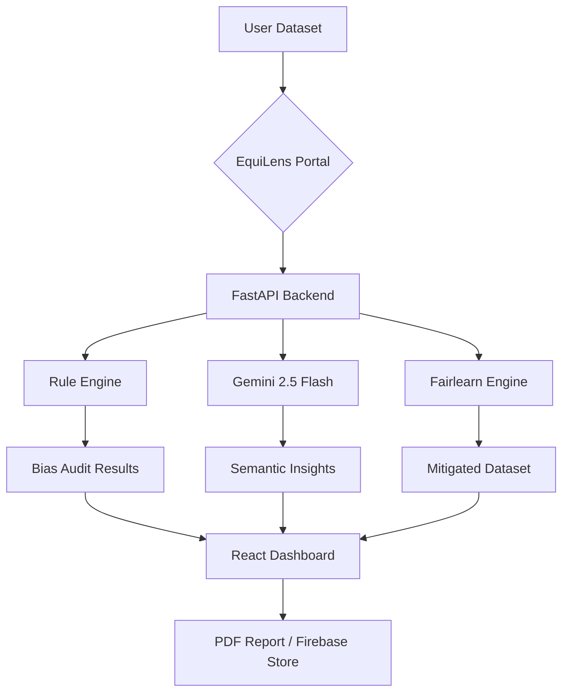

# EquiLens: Illuminating Bias, Engineering Equity ⚖️🔍

[](https://developers.google.com/community/solutions-challenge)
[](https://opensource.org/licenses/MIT)
[](https://deepmind.google/technologies/gemini/)

## 🌟 Overview
**EquiLens** is an end-to-end AI fairness auditing and mitigation platform designed to identify, analyze, and rectify algorithmic bias in machine learning datasets and models. By combining traditional statistical fairness metrics with state-of-the-art Large Language Models (LLMs), EquiLens provides both numerical precision and contextual understanding to the complex problem of AI bias.

---

## 🚀 The Problem & Solution

### The Challenge
As AI systems increasingly manage high-stakes decisions—from hiring and lending to healthcare—they often inherit and amplify historical human biases. Developers frequently lack the tools to detect "proxy bias" (where non-sensitive features act as stand-ins for protected groups) or the expertise to apply complex mitigation algorithms.

### The EquiLens Solution
EquiLens democratizes AI ethics by providing:
1.  **Contextual Auditing:** Using **Google Gemini** to understand the semantic meaning of features beyond simple column names.
2.  **Quantitative Metrics:** Calculating industry-standard fairness indicators like Demographic Parity and Disparate Impact.
3.  **Automated Mitigation:** Implementing "In-Processing" bias reduction using `Fairlearn` to create fairer models without sacrificing significant accuracy.
4.  **Actionable Transparency:** Generating comprehensive PDF reports and multi-lingual summaries for non-technical stakeholders.

---

## 🎯 Sustainable Development Goals (SDGs)
EquiLens is built to directly address the **United Nations Sustainable Development Goals**:

*   **Goal 10: Reduced Inequalities** – By ensuring AI models treat all demographic groups fairly, preventing algorithmic discrimination.
*   **Goal 5: Gender Equality** – Specifically detecting and mitigating gender-based bias in datasets like hiring or salary prediction.
*   **Goal 16: Peace, Justice, and Strong Institutions** – Promoting accountability and transparency in the automated systems that govern modern society.

---

## 🛠️ Built With (Google Tech Stack)

EquiLens leverages the best of Google's ecosystem to provide a seamless and powerful user experience:

*   **[Gemini 2.5 Flash Lite](https://deepmind.google/technologies/gemini/)**: Powering the semantic bias engine and providing natural language recommendations for bias mitigation.
*   **[Firebase](https://firebase.google.com/)**: Handling real-time data storage (Firestore) and frontend hosting.
*   **[Google Sheets API](https://developers.google.com/sheets/api)**: Enabling users to import datasets directly from their cloud workspace for immediate auditing.
*   **[Google Cloud Platform](https://cloud.google.com/)**: Serving as the robust infrastructure for the FastAPI backend.

### Other Technologies:
*   **Frontend**: React.js (Vite), Tailwind CSS, Recharts (Visualizations), Material UI.
*   **Backend**: FastAPI (Python), Pandas, Scikit-Learn.
*   **AI/ML**: Fairlearn (Bias Mitigation), RapidFuzz (Fuzzy Feature Matching).

---

## ✨ Key Features

-   **📁 Versatile Ingestion**: Upload CSV/Excel files or link a Google Sheet.
-   **🕵️ Rule-Based + LLM Detection**: Detects direct sensitive attributes (Race, Gender) and hidden proxies (Zip Code, Surname).
-   **📈 Fairness Dashboard**: Interactive charts showing disparity across different demographic slices.
-   **🔧 Bias Fixer**: One-click mitigation using **Exponentiated Gradient Reduction** to rebalance model outcomes.
-   **📄 Exportable Reports**: Generate professional-grade PDF audits for compliance and documentation.
-   **🌐 Multi-lingual Insights**: Summaries available in both English and Hindi to bridge the accessibility gap.

---

## 🏗️ Architecture



---

## ⚙️ Installation & Setup

### Prerequisites
- Python 3.9+
- Node.js 18+
- Google Gemini API Key

### Backend Setup
1.  Navigate to the backend directory:
    ```bash
    cd backend
    ```
2.  Install dependencies:
    ```bash
    pip install -r requirements.txt
    ```
3.  Create a `.env` file:
    ```env
    API_KEY=your_gemini_api_key
    ALLOWED_ORIGINS=*
    ```
4.  Run the server:
    ```bash
    python main.py
    ```

### Frontend Setup
1.  Navigate to the frontend directory:
    ```bash
    cd frontend
    ```
2.  Install dependencies:
    ```bash
    npm install
    ```
3.  Configure Firebase in `src/firebase.js` or via `.env`.
4.  Start the development server:
    ```bash
    npm run dev
    ```

---

## 🔮 Future Roadmap
-   **Real-time Monitoring**: Integrate with production models to detect bias drift as new data arrives.
-   **Synthetic Data Generation**: Using LLMs to generate balanced datasets for edge cases.
-   **Expanded Library**: Adding support for NLP and Image model bias auditing.

---

## 🤝 The Team
Developed for the **2026 Google Solution Challenge**. We believe that technology should be a force for equity, and EquiLens is our contribution to a fairer digital future.

---

## 📄 License
This project is licensed under the MIT License - see the [LICENSE](LICENSE) file for details.
