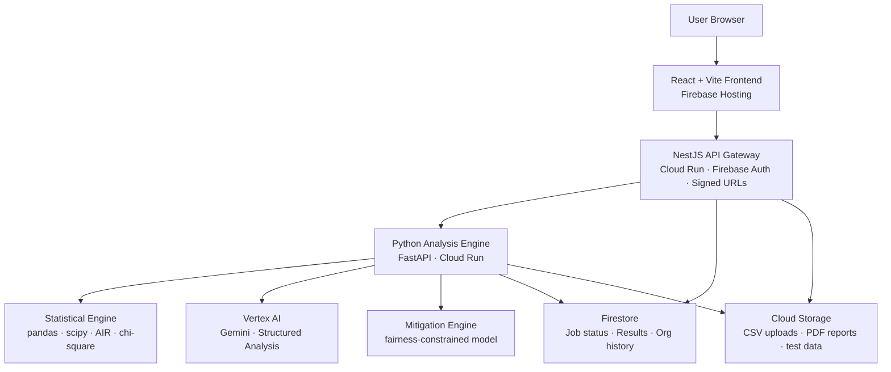

<div align="center">

<br/>

```
███████╗ ██████╗ ██╗   ██╗██╗██╗     ███████╗███╗   ██╗███████╗
██╔════╝██╔═══██╗██║   ██║██║██║     ██╔════╝████╗  ██║██╔════╝
█████╗  ██║   ██║██║   ██║██║██║     █████╗  ██╔██╗ ██║███████╗
██╔══╝  ██║▄▄ ██║██║   ██║██║██║     ██╔══╝  ██║╚██╗██║╚════██║
███████╗╚██████╔╝╚██████╔╝██║███████╗███████╗██║ ╚████║███████║
╚══════╝ ╚══▀▀═╝  ╚═════╝ ╚═╝╚══════╝╚══════╝╚═╝  ╚═══╝╚══════╝
```

### **AI-Powered Bias Detection & Mitigation Platform**
*Catch bias before it catches someone.*

<br/>

[](https://developers.google.com/community/gdsc-solution-challenge)
[](#)
[](https://cloud.google.com/vertex-ai)
[](LICENSE)

---

## 🎬 &nbsp; See It In Action

<br/>

> **[🌐 &nbsp; Live Demo](https://equilens.devarghya.in)**

> **[▶ &nbsp; Watch Full Demo Video](https://equilens.devarghya.in/demoVideo.mp4)**

> **[📦 &nbsp; Download Test Dataset for Judges](https://github.com/Arghya-2007/solution-challenge/tree/main/processing-server/data)**
> *(Biased HR hiring data with injected bias across gender, age, and group identity)*

<br/>

---

</div>

<br/>

## 🧨 &nbsp; The Problem

<br/>

HR, lending, and admissions teams make decisions using datasets that carry decades of human bias baked in. They don't know it. Their models learn it. Their decisions replicate it, every quarter, at scale — and automated tools process thousands of those decisions in seconds, embedding the bias invisibly and legally.

<br/>

```
A candidate with the same qualifications as another can be hired,
approved, or admitted at a meaningfully different rate purely
based on a protected attribute baked into historical data.

That's not a data problem. That's a people problem hiding inside a CSV.
```

<br/>

| The Reality | The Scale |
|---|---|
| 📊 Most large companies use algorithmic screening in hiring, lending, or admissions | Few audit it for bias before deployment |
| ⚖️ Adverse impact violations are usually found only after a complaint or lawsuit | By then it's a legal problem, not a data problem |
| 💸 Discrimination-related turnover and litigation carries real, compounding cost | Existing tools surface numbers, not explanations |
| 🤖 Algorithmic hiring tools have been pulled after being found to discriminate at scale | Most teams have no equivalent internal audit |

<br/>

**Most stakeholders reading these decisions are not data scientists.** They can't audit a model's internals. They have no tool to ask *"is my data treating everyone fairly?"* — until now.

<br/>

---

## 💡 &nbsp; What EquiLens Does

<br/>

Upload a dataset. EquiLens tells you exactly where bias lives, how severe it is, and gives you back a dataset where that bias has been algorithmically reduced.

<br/>

```
                     ┌─────────────────────────────────────────────┐
                     │                                             │
   Upload CSV  ──►   │   Statistical    ──►   Vertex AI   ──►      │  ──►  Risk Score
                     │   Pre-Processing       Gemini Analysis      │       + Report
                     │   Engine                                    │       + Fixed CSV
                     │                                             │
                     └─────────────────────────────────────────────┘
```

**Contextual Auditing** — Gemini interprets the semantic meaning of dataset columns beyond their literal names, so the system understands what a feature represents, not just what it's called.

**Quantitative Metrics** — Demographic Parity, chi-square, and Disparate Impact / Adverse Impact Ratio, calculated per protected attribute.

**Automated Mitigation** — Pre-Processing, In-Processing, and Post-Processing bias reduction to produce fairer outcomes without sacrificing significant accuracy.

**Actionable Transparency** — comprehensive PDF reports and multilingual summaries so non-technical stakeholders can act on findings, not just read them.

<br/>

### What You Get Back

```
┌─────────────────────────────────────────────────────────────────────────────┐
│   ● Overall Bias Risk Score   (0–100)                                       │
│   ● Per-Attribute Analysis    gender · age · ethnicity · group identity     │
│   ● Adverse Impact Ratio      EEOC 80% Rule compliance check                │
│   ● Intersectionality Matrix  e.g. minority female vs majority male         │
│   ● Missingness Disparity     unequal missing data across demographic groups│
│   ● Fix Simulations           before/after score if a column is removed     │
│   ● Mitigated Dataset         downloadable CSV with rebalanced outcomes     │
│   ● PDF Compliance Report     printable, ready for review                   │
└─────────────────────────────────────────────────────────────────────────────┘
```

<br/>

---

## ⚙️ &nbsp; How It Works

<br/>

**1. Upload** — user uploads a CSV (or connects Google Sheets). The frontend gets a signed URL from the API gateway and uploads directly to Cloud Storage.

**2. Statistical Pre-Processing** — before any AI call, the Python engine runs Demographic Parity, chi-square significance testing, and proxy correlation checks (e.g. zip code standing in for race) to find both explicit and hidden bias.

**3. Vertex AI Analysis** — the statistical summary (not the raw data) is sent to Gemini via Vertex AI, which returns a plain-English explanation of each finding and a specific recommendation.

**4. Mitigation** — a fairness-constrained model retrains on the data to rebalance outcomes across protected groups while preserving overall predictive signal.

**5. Results** — a risk score dashboard, findings breakdown, fix simulations, PDF report, and the mitigated CSV.

<br/>

---

## 🏗️ &nbsp; Architecture



<br/>

---

## 🔬 &nbsp; What We Detect

| Bias Type | Detection Method | Legal / Standards Reference |
|---|---|---|
| Gender / Ethnicity Disparity | Demographic Parity + Adverse Impact Ratio | EEOC 4/5ths Rule, Title VII |
| Age Discrimination | Binned group selection rates | Age Discrimination in Employment Act |
| Proxy Discrimination | Correlation between features and protected attributes | EU AI Act high-risk classification |
| Intersectional Bias | Cross-group heatmap (e.g. gender × ethnicity) | Intersectionality framework |
| Missing Data Disparity | Imputed vs. provided value comparison across groups | ISO 30415:2021 |

<br/>

---

## ☁️ &nbsp; Google Technology Stack

| Service | How We Use It |
|---|---|
|  **Vertex AI** | Gemini for structured bias analysis and plain-language explanations |
|  **Firebase Auth** | JWT validation with org-scoped roles |
|  **Cloud Run** | Serverless hosting for the API gateway and the Python analysis engine |
|  **Firestore** | Async job status, results, and org-scoped audit history |
|  **Cloud Storage** | CSV uploads via signed URL, PDF reports, demo/test datasets |
|  **Firebase Hosting** | Frontend CDN deployment |
|  **Cloud Build** | CI/CD, auto-deploy on push to `main` |
|  **Secret Manager** | Credentials and API keys |

### Broader Stack

| Layer | Tech |
|---|---|
| Frontend | React + Vite, Tailwind CSS, Material UI, Recharts |
| API Gateway | NestJS |
| Analysis Engine | Python, FastAPI, pandas, scipy, scikit-learn |
| Fairness / Mitigation | ML Model, plus a separate adversarial debiasing path |
| AI Layer | Vertex AI, Gemini |

> **Note on mitigation approach:** different drafts of this project have described the mitigation step as both a fairness-constrained Random Forest and as an adversarial debiasing pass. What we actually exercised in testing was `run_universal_adversarial_mitigation()`, called via a standalone CLI script. If the production web app's mitigation step uses a different underlying model than the CLI, it's worth aligning the description here to whichever one the demo actually runs.

<br/>

---

## 📊 &nbsp; Dataset Format

EquiLens accepts any tabular dataset (CSV or connected Google Sheet). For best results, include:

```
REQUIRED ──────────────────────────────────────────────────────
  outcome column      e.g. hiring_decision · loan_approved · promoted

PROTECTED ATTRIBUTES (auto-detected) ──────────────────────────
  gender, ethnicity, age (or a bucketed age_group)

LEGITIMATE FEATURES ─────────────────────────────────────────────
  experience, scores, income, credit history, etc. — anything
  that legitimately drives the outcome
```

Column roles are auto-detected by name pattern and confirmed statistically — no manual labeling required.

<br/>

---

## ✅ &nbsp; Validated Results

We stress-tested the mitigation engine end-to-end on synthetic datasets to confirm it behaves as intended before relying on it for the live demo.

On a synthetic loan approval dataset (500 records, three protected attributes with deliberately injected bias):

| Protected Attribute | Before (Disparity) | After (Disparity) | Change |
|---|---|---|---|
| Ethnicity | 0.276 | 0.043 | 84% |
| Gender | 0.322 | 0.122 | 62% |
| Age Group | 0.149 | 0.088 | 41% |

All three attributes improved simultaneously with no subgroup overcorrected to an extreme outcome — this is the run we lead with in the live demo.

### Things we caught during testing

- **Small protected groups can get overcorrected.** Groups under ~20–30 samples were prone to extreme rebalancing (one subgroup jumped from 17% to 100% selection rate). Fixed by bucketing fine-grained categories and enforcing a minimum group size before mitigation.
- **Already-fair datasets can regress slightly.** When pre-existing disparity was already low (~0.15), mitigation nudged it in the wrong direction rather than leaving it alone.
- **A status-tracking bug** in the CLI pipeline marked failed runs as complete; fixed with explicit success/failure branching.

<br/>

---

## 🚀 &nbsp; Local Development

### Prerequisites
```
Node.js 20+      (API Gateway + Frontend)
Python 3.11+     (Analysis Engine)
Firebase CLI     (Frontend + Auth)
gcloud CLI       (GCP services)
```

### Clone & Setup

```bash
git clone https://github.com/Arghya-2007/solution-challenge.git
cd solution-challenge
```

**Frontend**
```bash
cd frontend
npm install
cp .env.example .env.local    # fill in your Firebase config
npm run dev
```

**API Gateway (NestJS)**
```bash
cd api-gateway
npm install
cp .env.example .env          # fill in GCP project + Firebase admin credentials
npm run start:dev
```

**Analysis Engine (Python)**
```bash
cd processing-server
python -m venv venv
source venv/bin/activate      # Windows: venv\Scripts\activate
pip install -r requirements.txt
cp .env.example .env          # fill in Vertex AI project + region
uvicorn main:app --reload --port 8081
```

**Standalone: generate a debiased dataset without the full stack**

```bash
cd processing-server
python run_mitigation.py data/<name>
# expects data/<name>_clean.csv and data/<name>_config.json
# writes data/<name>_debiased.csv + prints before/after disparity report
```

<br/>

---

## 📁 &nbsp; Repository Structure

```
solution-challenge/
│
├── frontend/                    # React + Vite — Firebase Hosting
│   ├── src/
│   │   ├── components/          # Dashboard, findings cards, charts
│   │   ├── pages/                # Upload, Results, History, Report
│   │   └── lib/                   # Firebase client, API calls
│   └── firebase.json
│
├── api-gateway/                 # NestJS — Cloud Run
│   ├── src/
│   │   ├── auth/                  # Firebase JWT validation
│   │   ├── jobs/                  # Job create, status, results endpoints
│   │   ├── storage/                # GCS signed URL generation
│   │   └── report/                  # PDF signed URL endpoint
│   └── Dockerfile
│
├── processing-server/           # Python FastAPI — Cloud Run
│   ├── main.py                  # FastAPI entry point (uvicorn)
│   ├── run_mitigation.py        # standalone CLI — debiased CSV + before/after report
│   ├── core/
│   │   ├── preprocessor.py
│   │   ├── statistical_engine.py
│   │   ├── vertex_client.py
│   │   ├── scoring.py
│   │   └── mitigator.py
│   ├── src/
│   │   ├── debiasingEngine.py   # run_universal_adversarial_mitigation()
│   │   └── status.py
│   ├── report/
│   │   └── generator.py
│   ├── data/                    # 📦 test datasets (incl. judge sample data)
│   └── Dockerfile
│
└── cloudbuild.yaml              # CI/CD — auto-deploy on push
```

<br/>

---

## 🔑 &nbsp; Environment Variables

Each service expects its own `.env` (copy from `.env.example`). Placeholders below — fill in real values before running.

**`api-gateway/.env`**
```
PORT=
FIREBASE_PROJECT_ID=
FIREBASE_CLIENT_EMAIL=
FIREBASE_PRIVATE_KEY=
PROCESSING_SERVER_URL=
JWT_SECRET=
```

**`processing-server/.env`**
```
GEMINI_API_KEY=
VERTEX_AI_PROJECT=
VERTEX_AI_REGION=
GOOGLE_APPLICATION_CREDENTIALS=
GCS_BUCKET_NAME=
PORT=
```

**`frontend/.env.local`**
```
NEXT_PUBLIC_API_BASE_URL=
NEXT_PUBLIC_FIREBASE_API_KEY=
NEXT_PUBLIC_FIREBASE_PROJECT_ID=
```

> Never commit real `.env` files — keep them in `.gitignore` and share secrets via Secret Manager or your team's password manager.

<br/>

---

## 🗺️ &nbsp; Future Development

- ✅ Parallel processing
- AI Assistant
- ✅ History
- All file support (image-based datasets)
- Multilingual interface
- Native mobile app (Android / iOS)

<br/>

---

## 💰 &nbsp; Estimated Monthly Cost

| Item | Cost |
|---|---|
| Model | ₹1,000 |
| Backend Deployment | ₹1,000 |
| Frontend Deployment | ₹1,000 |
| R&D | ₹3,000 |
| **Total** | **₹6,000** |

<br/>

---

## 📜 &nbsp; Bias Frameworks We Reference

- **EEOC 4/5ths Rule** — Adverse Impact Ratio threshold for US hiring law
- **EU AI Act** — high-risk AI system classification for employment screening tools
- **Equal Pay Act** — compensation gap analysis standards
- **ISO 30415:2021** — international HR diversity and inclusion metrics

<br/>

---

## 👥 &nbsp; The Team

Team **Semicolons**, led by **Aayush Laddha** — built for Google Solution Challenge 2026, Top 100.

| Role | Owns |
|---|---|
| AI / ML + Python Backend | Bias detection algorithms · Vertex AI integration · mitigation engine · PDF report generation |
| Cloud / DevOps + Frontend | Firebase Auth · Cloud Run deployment · Firestore architecture · CI/CD · dashboard UI |

<br/>

---

## 📄 License

MIT — see `LICENSE`.

<div align="center">

<br/>

*EquiLens — Google Solution Challenge 2026*

[](https://developers.google.com/community/gdsc-solution-challenge)

</div>
